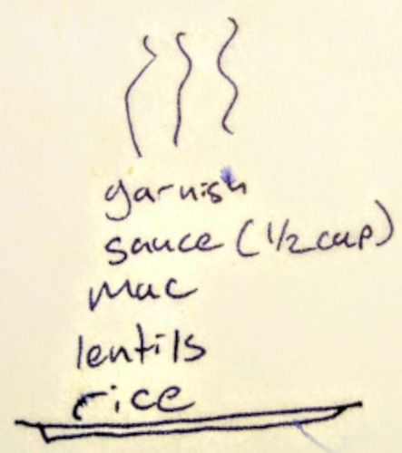

# Koshari

Egyptian comfort food.

from: [Nikki & David Goldbeck's American Wholefoods Cuisine](https://isbn.nu/0452262801)

*dinner*

**5 Servings**

---

- *4 C* cooked brown rice
- *4 C* Spicy Lentils
- *2 C* cooked elbow macaroni
- *1* 16 oz. can of fire-roasted diced tomatoes
- *1* 8 oz. can of tomato sauce
- *1 t* agave
- *1 t* salt
- *1 t* chili powder
- *1 t* paprika (or more chili powder)
- *1/2 t* cumin
- *1 or 2 t* olive oil
- *1* medium onion, thinly sliced
- olive oil for frying onions

---

Start the rice, start water for the pasta, and secure your spicy lentils. If 
they're frozen, thaw them in the microwave. If they're fresh, measure out what 
you need, then put the rest in freezer containers and in the freezer. Start the 
sauce: in a small sauce pan over medium-low heat, add the tomatoes and sauce, 
agave, salt, spices, and olive oil. Let it simmer. Slice the onion very thinly, 
and either air fry them (spray with a bit of olive oil) or pan-fry them in a 
splash of olive oil, until they are crispy without being entirely charred. If 
you *do* char them, don't worry, they'll still taste good. Boil the noodles.
When the rice is done, everything should be ready to assemble. Go in this order:
rice, lentils, mac, sauce, garnish. Or, refer to the cheetsheat below.

